# SetupV2ray

自建一个服务器并通过使用 v2ray 网络代理来实现 google 搜索

## 前言

第一次搭建服务器用于 goolge 搜索，遇到了各种问题，因此特地做个笔记记录下来，以便以后查看。


## 环境

- 系统： Fedora 29
- 软件工具： v2ray 4.18.0


## 教程

搭建 v2ray 服务器主要分为几步：

1. [**购买 VPS 服务器**](#v1)
2. [**安装 v2ray 服务代理**](#v2)
3. [**安装 v2ray 客户端**](#v3)
4. [**浏览器安装代理插件**](#v4)

下面分别说明这些步骤的具体内容。

---

### 1. <span id="v1">购买 VPS 服务器</span>

#### 1.1 注册 vultr 账号

VPS 服务器选择的是国外的 vultr，按小时计费，随时可以停止服务器，比较好用。首先去它的[官网](https://www.vultr.com/)注册并激活一个账号：

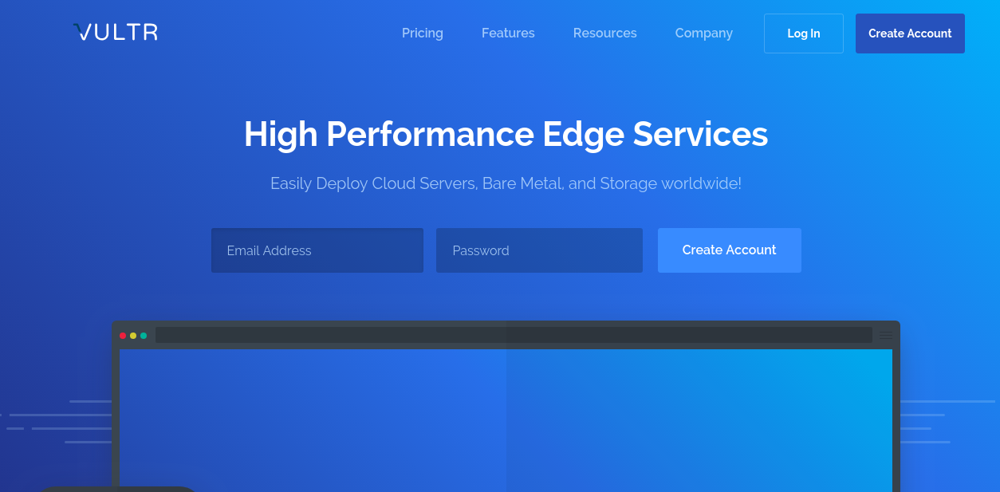

---

#### 1.2 账号充值

为了购买 VPS 服务器，必须先充值，充值的方式有很多种，比如信用卡、比特币，支付宝等等。选择支付宝付款充值（也可以选择其他支付方式，看个人情况）：

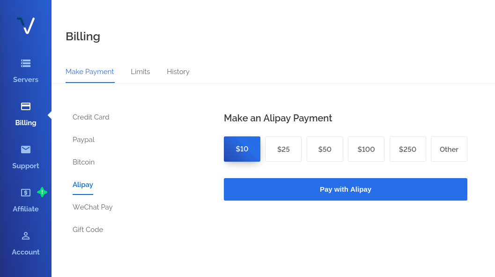

---

#### 1.3 购买服务器

充值之后，就可以去购买 VPS 服务器了，选择左边菜单栏中的 Server，在右边界面中选择 Instance 标签，然后点击界面右上角的“+”号添加新服务器：

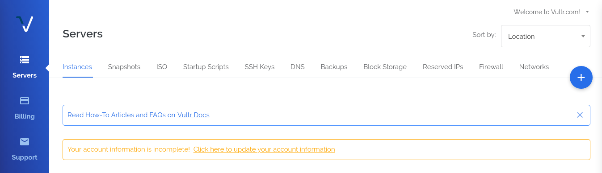

添加界面中选择 Vultr Cloud Compute (VC2) 标签，然后完成下面几个步骤。

第一步：选择服务器的位置（Server Location），可选的位置很多，先随意选择，如果部署服务器之后服务器无法正常使用（也就是服务器 ip 被墙了），可以再换另外一个地址：

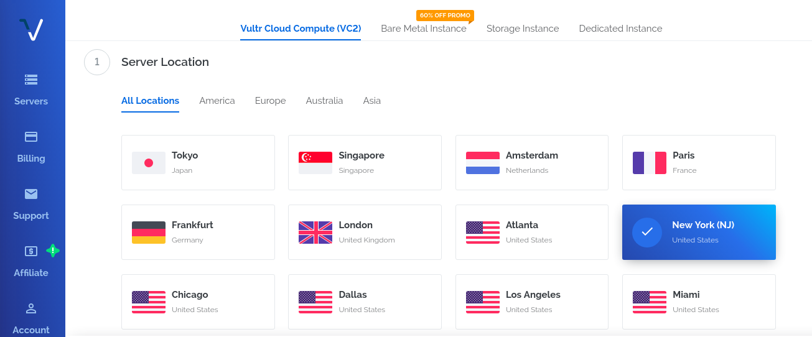

第二步：选择服务器类型（Server Type），因为要在服务器部署 v2ray 代理。为了配合后面使用的 v2ray 一键搭建脚本，服务器类型推荐选择 Debian 8，当然也可以选择 Ubuntu 14、Ubuntu 16、CentOS 7 等其他类型：

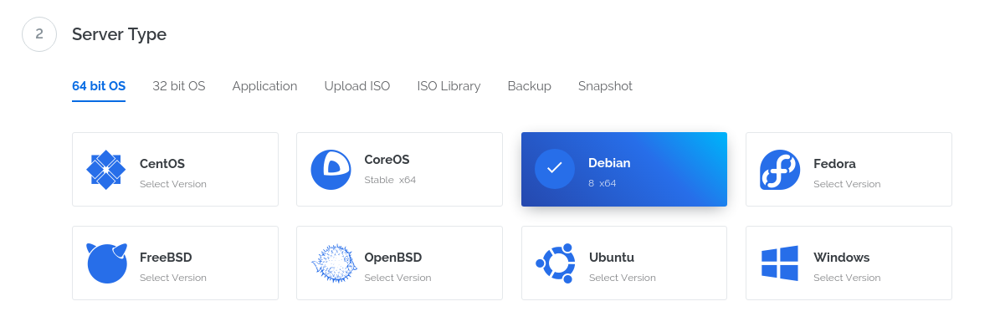

第三步：选择服务器容量，主要包括 CPU 数量，内存大小，磁盘容量以及带宽等，同时也给出了服务器的计费价格：

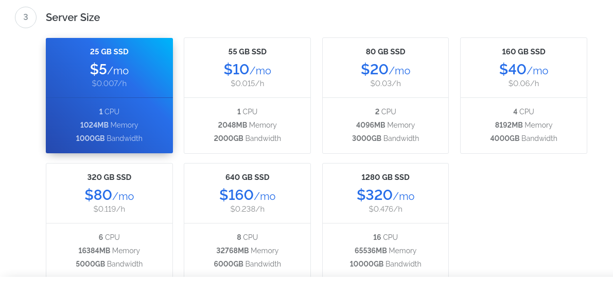

到这里基本就可以了，后面的几个选项不是很重要，可以不填，因此选择现在部署服务器（Deploy Now）就可以了：

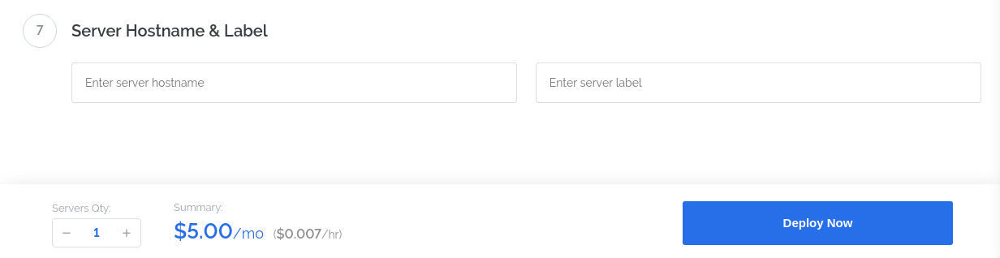

接下来就是等待服务器的部署完成，估计需要几分钟时间，<span style="color:red">当服务器状态显示为【Running】状态时，说明已经部署完成并正在运行了</span>。等待完成之后，就可以对服务器的 ip 进行 ping 操作，试一试是否能够连接服务器，如果无法 ping 通，那么就需要按照上面的步骤再重新部署一个新的服务器：

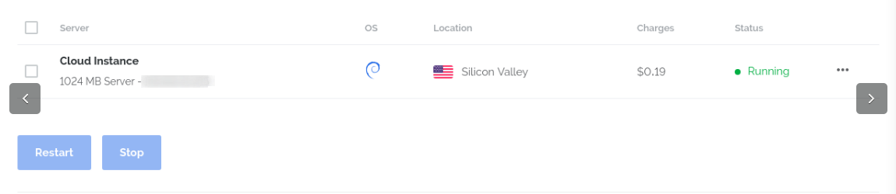

测试是否能够 ping 通服务器，有返回说明可以连接服务器，超时没有返回则说明该服务器 ip 已经被墙了，导致无法连接服务器。ping 命令的执行格式如下：

```
# 假设 ip 为 8.8.8.8
ping 8.8.8.8
```

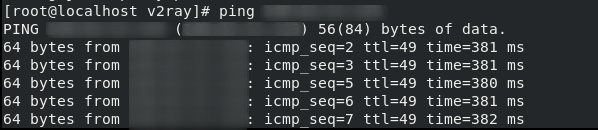

如果无法连接服务器，就需要重新部署一个新的服务器，并将无用服务器删除掉。<span style="color:red">最好是先添加新的服务器，然后再删除旧服务器</span>，因此有时候你如果先删除旧服务器再去添加新服务器的话，有可能新的服务器还是原来的旧服务器。删除服务器如下：

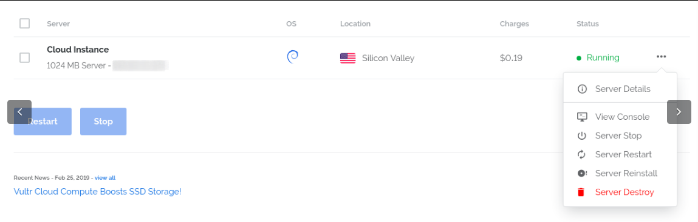

如果一切顺利，部署完成之后就可以看见服务器的详细信息了，包括了服务器的 ip，管理员账号以及密码，服务器使用情况等等：

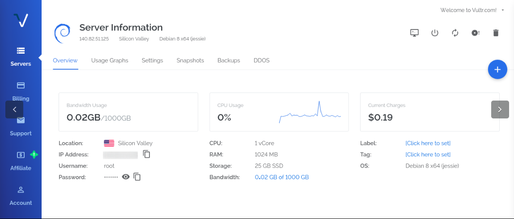

---

####2. <span id="v2">安装 v2ray 服务代理</span>

#### 2.1 远程登录服务器

部署完服务器之后，就需要在服务器上安装代理工具软件 v2ray，这里是通过 v2ray 一键搭建脚本来完成安装。为了运行该脚本，需要远程登录到服务器上。可以直接使用 ssh 登录服务器（Windows 可以用第三方工具 Xshell 来远程登录服务器，界面比较友好）：

```
# 假设服务器 ip 为 8.8.8.8
ssh root@8.8.8.8
# 后面接着输入服务器密码
```

远程登录效果如下：

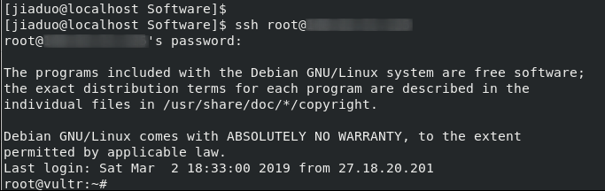

---

#### 2.1 安装 v2ray

连接登录成功之后，就可以开始安装 v2ray 了，直接执行 v2ray一键部署管理脚本，命令如下（该命令的含义就是从网上下载 install.sh 脚本文件并执行此脚本）：

```
wget -N --no-check-certificate https://raw.githubusercontent.com/KiriKira/v2ray.fun/kiriMod/install.sh && bash install.sh
```

如果想要<span style="color:red">卸载 v2ray 软件</span>，可以执行以下命令：

```
wget -N --no-check-certificate https://raw.githubusercontent.com/KiriKira/v2ray.fun/kiriMod/uninstall.sh && bash uninstall.sh
```

休息几分钟等待 v2ray 安装完成，完成之后输入命令：v2ray，进入 v2ray 的配置管理界面，输入2进入更改配置部分，然后分别修改其中的配置信息：

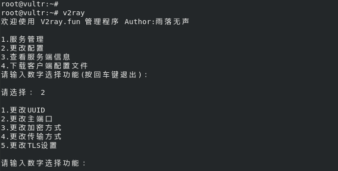

第一步：更改 UUID，输入数字1，后面输入 y 确认：

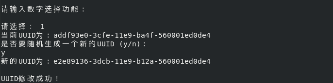

第二步：更改主端口，输入数字2，端口范围40～65535，理论上可以任意设置：

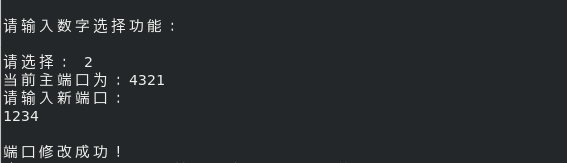

第三步：更改加密方式，输入数字3：

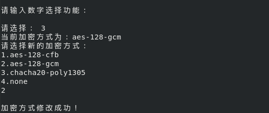

第四步：更改传输方式，输入数字4，输方式共有7种，这个对 v2ray 的速度有很大影响，具体选择哪个看自己的网络环境：

> 注意：普通TCP、普通mKCP、mKCP伪装FaceTime通话、mKCP伪装BT下载流量、mKCP伪装微信视频流量可直接设置、不需要域名，HTTP伪装和WebSocket流量需要你有域名，且域名绑定了你的vps服务器ip。

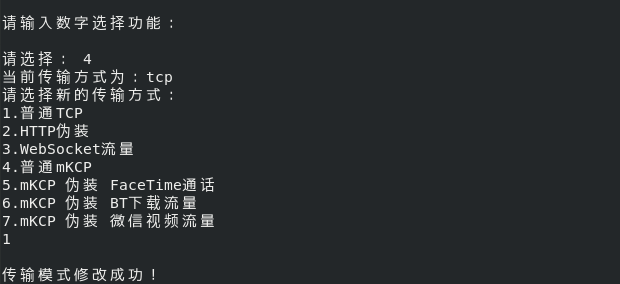

第五步：启动或重新启动 v2ray 服务，修改完上面几个配置之后，需要重新启动 v2ray 服务。因此回到 v2ray 管理首页，两次输入数字1（或者第二次输入3）：

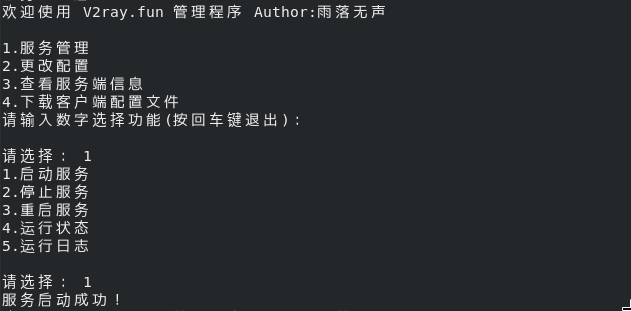

到此，服务器端的 v2ray 配置已经结束了，在 v2ray 管理首页中输入数字3可以查看服务器中 v2ray 的具体配置信息：

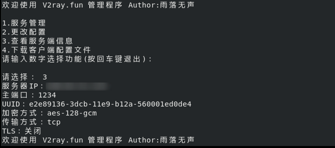

最后，需要把 v2ray 服务端的配置文件下载到本地机器（其实也不用下载下来，只需要知道配置文件的内容即可，但是下下来比较方便查看），可以使用 scp 命令复制配置文件到本地机器中，服务端的配置文件是 /etc/v2ray/config.json ：

```
# 复制到当前目录（.），需要输入服务器密码
scp root@8.8.8.8:/etc/v2ray/config.json .
```

配置文件内容大致如下：

```
{
 "outbound": {
  "streamSettings": null,
  "tag": null,
  "protocol": "freedom",
  "mux": null,
  "settings": null
 },
 "log": {
  "access": "/var/log/v2ray/access.log",
  "loglevel": "info",
  "error": "/var/log/v2ray/error.log"
 },
 "inboundDetour": null,
 "inbound": {
  "streamSettings": {
   "network": "tcp",
   "kcpSettings": null,
   "wsSettings": null,
   "tcpSettings": null,
   "tlsSettings": {},
   "security": ""
  },
  "listen": null,
  "protocol": "vmess",
  "port": 1234,
  "settings": {
   "ip": null,
   "udp": true,
   "clients": [
    {
     "alterId": 100,
     "security": "aes-128-gcm",
     "id": "e2e89136-3dcb-11e9-b12a-560001ed0de4"
    }
   ],
   "auth": null
  }
 },
 "outboundDetour": [
  {
   "tag": "blocked",
   "protocol": "blackhole",
   "settings": null
  }
 ],
 "routing": {
  "strategy": "rules",
  "settings": {
   "rules": [
    {
     "ip": [
      "0.0.0.0/8",
      "10.0.0.0/8"
     ],
     "domain": null,
     "type": "field",
     "port": null,
     "outboundTag": "blocked"
    }
   ],
   "domainStrategy": null
  }
 },
 "dns": null
}
```


---


### 3. <span id="v3">安装 v2ray 客户端</span>

安装好服务端的 v2ray 之后，还需要在本地机器上安装 v2ray 的客户端。对于 Linux 之类的机器系统而言，安装过程和服务器端安装类似，而 Windows 则使用安装包来完成安装：

> 下载地址： https://github.com/v2ray/v2ray-core/releases

Linux 系统可以直接使用一键安装命令来安装 v2ray：

```
bash <(curl -L -s https://install.direct/go.sh)
```

安装完成之后，需要对客户端的 v2ray 配置文件进行一些修改，使它可以连上服务器端的 v2ray。同样地，本地机器的配置文件路径在 /etc/v2ray/config.json，主要对 outbounds 中的 address，port 和 id 进行修改：

```
{
  "inbounds": [{
    "port": 1080,
    "protocol": "socks",
    "sniffing": {
      "enabled": true,
      "destOverride": [
	      "http",
	      "tls"
       ]
    },
    "settings": {
      "udp": true	// 开启 UDP 协议支持
    }
  },{
     "port": 8080,
     "protocol": "http",
     "sniffing": {
       "enabled": true,
       "destOverride": [
	       "http",
	       "tls"
       ]
    }
  }],
  "outbounds": [{
    "protocol": "vmess",
    "settings": {
       "vnext": [{
	       "address": "8.8.8.8", // 服务器 IP
	       "port": 1234, // 服务端 v2ray 配置的端口
	       "users": [{
             // 服务端 v2ray 配置的 UUID
             "id": "e2e89136-3dcb-11e9-b12a-560001ed0de4",
	         "alterId": 4 // 比服务端的值小
	       }]
       }]
    }
  },{
    "tag": "direct",
    "protocol": "freedom",
    "settings": {}
  },{
    "protocol": "blackhole",
    "settings": {},
    "tag": "blocked"
  }],
  // 配置路由功能，绕过局域网和中国大陆地址
  "routing": {
    "domainStrategy": "IPODemand",
    "rules": [
      {
        "type": "field",
        "ip": ["geoip:private"],
        "outboundTag": "blocked"
      }
    ]
  }
}
```

因为修改了配置信息，因此需要重新启动 v2ray 服务，执行以下命令重启服务：

```
systemctl restart v2ray
```

此时 v2ray 客户端已经正常运行，为了能够让目标软件（比如Chrome）使用这个代理，后面还需要对系统进行一些配置。

---

### 4. <span id="v4">浏览器安装代理插件</span>

为了让浏览器使用 v2ray 代理，还需要在浏览器中安装插件<span style="color:red">（Windows 客户端一般都有自动设置 PAC 系统代理，不需要浏览器插件就可以分网站使用代理，因此这部分内容只针对 Linux 客户端）</span>，使得浏览器访问页面时经过代理服务器，最终访问到所需的页面。Chrome 需要安装扩展插件 Omega，而 Firefox 需要 Proxy SwitchyOmega，其实这两个都是同一个插件。插件下载地址如下：

> 下载地址： https://github.com/FelisCatus/SwitchyOmega/releases

安装完扩展插件之后需要重启浏览器生效，进入 SwitchyOmega 的配置界面，选择【Proxy】标签页，设定默认 Proxy 为 SOCKS5 协议 127.0.0.1 地址 1080 端口，然后点击 Apply changes 使设定生效：

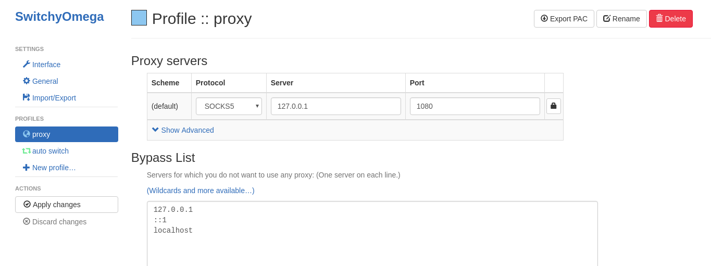

接下来选择【auto switch】标签页，设置 Rule List Config 中的 Rule List Format 为 AutoProxy，并在 Rule List URL 中填入规则文件路径：

> https://raw.githubusercontent.com/gfwlist/gfwlist/master/gfwlist.txt

点击 Download Profile Now 按钮下载文件，并将 Switch rules 中的 Rule list rules 的 Profile 改为 proxy 方式，最后点击 Apply changes 使设定生效。完成之后点击右上角的 Export PAC 导出代理规则，将此导出的代理文件（假设是 proxy.pac）存放在某处，例如放在 /etc/v2ray/proxy.pac 下。

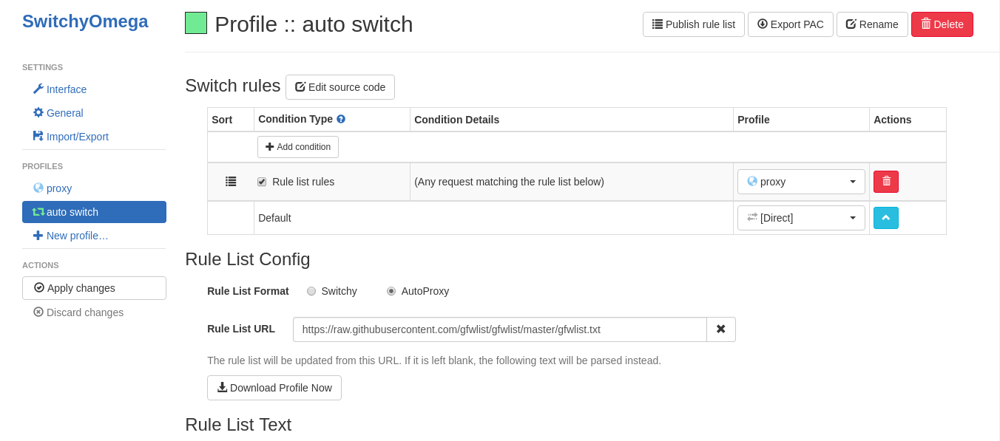

最后设定 PAC 代理，不同的Linux桌面环境会有区别。例如我的 Fedora 29 设置代理的方式为：
设置 —> Network —> Network Proxy，选择 Automatic 模式，填入 pac 文件绝对路径，比如我的就填：file:///etc/v2ray/proxy.pac。

至此，浏览器就可以访问 google 了(其实还有一个 BBR 加速，但是我安装失败了，装了好几次都不行，太惨了。。。)


### 参考教程

> https://github.com/firewallTutor/firewallTutor  
https://github.com/Alvin9999/new-pac/wiki/%E8%87%AA%E5%BB%BAv2ray%E6%9C%8D%E5%8A%A1%E5%99%A8%E6%95%99%E7%A8%8B  
https://yuan.ga/v2ray-complete-tutorial/
