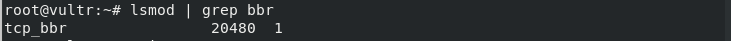

# SetupV2ray

自建一个服务器并通过使用 v2ray 网络代理来实现 google 搜索

## 前言

第一次搭建服务器用于 goolge 搜索，遇到了各种问题，因此特地做个笔记记录下来，以便以后查看。


## 环境

- 系统： Fedora 29
- 软件工具： v2ray 4.18.0


## 教程

搭建 v2ray 服务器主要分为几步：

1. [**购买 VPS 服务器**](#v1)
2. [**安装 v2ray 服务代理**](#v2)
3. [**安装 v2ray 客户端**](#v3)
4. [**浏览器安装代理插件**](#v4)
4. [**开启 BBR 加速**](#v5)

下面分别说明这些步骤的具体内容。

---

### 1. <span id="v1">购买 VPS 服务器</span>

#### 1.1 注册 vultr 账号

VPS 服务器选择的是国外的 vultr，按小时计费，随时可以停止服务器，比较好用。首先去它的[官网](https://www.vultr.com/)注册并激活一个账号：


---

#### 1.2 账号充值

为了购买 VPS 服务器，必须先充值，充值的方式有很多种，比如信用卡、比特币，支付宝等等。选择支付宝付款充值（也可以选择其他支付方式，看个人情况）：


---

#### 1.3 购买服务器

充值之后，就可以去购买 VPS 服务器了，选择左边菜单栏中的 【Server】，在右边界面中选择 【Instance】 标签，然后点击界面右上角的 “+” 号添加新服务器：


添加界面中选择 【Vultr Cloud Compute (VC2)】 标签，然后完成下面几个步骤。

第一步：选择服务器的位置（Server Location），可选的位置很多，先随意选择，如果部署服务器之后服务器无法正常使用（也就是服务器 ip 被墙了），可以再换另外一个地址：


第二步：选择服务器类型（Server Type），因为要在服务器部署 v2ray 代理。为了配合后面使用的 v2ray 一键搭建脚本，服务器类型推荐选择 Debian 8，当然也可以选择 Ubuntu 14、Ubuntu 16、CentOS 7 等其他类型：


第三步：选择服务器容量，主要包括 CPU 数量，内存大小，磁盘容量以及带宽等，同时也给出了服务器的计费价格：


到这里基本就可以了，后面的几个选项不是很重要，可以不填，因此选择现在部署服务器【Deploy Now】就可以了：


接下来就是等待服务器的部署完成，估计需要几分钟时间，<span style="color:red">当服务器状态显示为【Running】状态时，说明已经部署完成并正在运行了</span>：


接下来测试是否能够 ping 通服务器，有返回说明可以连接服务器，超时没有返回则说明该服务器 ip 已经被墙了，导致无法连接服务器。<span style="color:red">如果无法 ping 通，那么就需要按照上面的步骤再重新部署一个新的服务器（注意：这个网络连接测操作一定要做，否则后面无法正常使用）</span>。ping 命令的执行格式如下：

```bash
# 假设 ip 为 8.8.8.8
ping 8.8.8.8
```


如果无法连接服务器，就需要重新部署一个新的服务器，并将无用服务器删除掉。<span style="color:red">最好是先添加新的服务器，然后再删除旧服务器，因为有时候你如果先删除旧服务器，再去添加新服务器的话，新添加的服务器有可能是刚删除的旧服务器</span>。删除服务器如下：


如果一切顺利，部署完成之后就可以看见服务器的详细信息了，包括了服务器的 ip，管理员账号以及密码，服务器使用情况等等：


---

#### 2. <span id="v2">安装 v2ray 服务代理</span>

#### 2.1 远程登录服务器

部署完服务器之后，就需要在服务器上安装代理工具软件 v2ray，这里是通过 v2ray 一键搭建脚本来完成安装。为了运行该脚本，需要远程登录到服务器上。可以直接使用 ssh 登录服务器（Windows 可以用第三方工具 Xshell 来远程登录服务器，界面比较友好）：

```bash
# 假设服务器 ip 为 8.8.8.8
ssh root@8.8.8.8
# 后面接着输入服务器密码
```

远程登录效果如下：


---

#### 2.1 安装 v2ray

连接登录成功之后，就可以开始安装 v2ray 了，直接执行 v2ray一键部署管理脚本，命令如下（该命令的含义就是从网上下载 install.sh 脚本文件并执行此脚本）：

```bash
wget -N --no-check-certificate https://raw.githubusercontent.com/KiriKira/v2ray.fun/kiriMod/install.sh && bash install.sh
```

如果想要<span style="color:red">卸载 v2ray 软件</span>，可以执行以下命令：

```bash
wget -N --no-check-certificate https://raw.githubusercontent.com/KiriKira/v2ray.fun/kiriMod/uninstall.sh && bash uninstall.sh
```

休息几分钟等待 v2ray 安装完成，完成之后输入命令：v2ray，进入 v2ray 的配置管理界面，输入2进入更改配置部分，然后分别修改其中的配置信息：


第一步：更改 UUID，输入数字1，后面输入 y 确认：


第二步：更改主端口，输入数字2，端口范围40～65535，理论上可以任意设置：


第三步：更改加密方式，输入数字3：


第四步：更改传输方式，输入数字4，输方式共有7种，这个对 v2ray 的速度有很大影响，具体选择哪个看自己的网络环境：

> 注意：普通TCP、普通mKCP、mKCP伪装FaceTime通话、mKCP伪装BT下载流量、mKCP伪装微信视频流量可直接设置、不需要域名，HTTP伪装和WebSocket流量需要你有域名，且域名绑定了你的vps服务器ip。


第五步：启动或重新启动 v2ray 服务，修改完上面几个配置之后，需要重新启动 v2ray 服务。因此回到 v2ray 管理首页，两次输入数字1（或者第二次输入3）：


到此，服务器端的 v2ray 配置已经结束了，在 v2ray 管理首页中输入数字3可以查看服务器中 v2ray 的具体配置信息：


最后，需要把 v2ray 服务端的配置文件下载到本地机器（其实也不用下载下来，只需要知道配置文件的内容即可，但是下下来比较方便查看），可以使用 scp 命令复制配置文件到本地机器中，服务端的配置文件是 /etc/v2ray/config.json ：

```bash
# 复制到当前目录（.），需要输入服务器密码
scp root@8.8.8.8:/etc/v2ray/config.json .
```

配置文件内容大致如下：

```json
{
 "outbound": {
  "streamSettings": null,
  "tag": null,
  "protocol": "freedom",
  "mux": null,
  "settings": null
 },
 "log": {
  "access": "/var/log/v2ray/access.log",
  "loglevel": "info",
  "error": "/var/log/v2ray/error.log"
 },
 "inboundDetour": null,
 "inbound": {
  "streamSettings": {
   "network": "tcp",
   "kcpSettings": null,
   "wsSettings": null,
   "tcpSettings": null,
   "tlsSettings": {},
   "security": ""
  },
  "listen": null,
  "protocol": "vmess",
  "port": 1234,
  "settings": {
   "ip": null,
   "udp": true,
   "clients": [
    {
     "alterId": 100,
     "security": "aes-128-gcm",
     "id": "e2e89136-3dcb-11e9-b12a-560001ed0de4"
    }
   ],
   "auth": null
  }
 },
 "outboundDetour": [
  {
   "tag": "blocked",
   "protocol": "blackhole",
   "settings": null
  }
 ],
 "routing": {
  "strategy": "rules",
  "settings": {
   "rules": [
    {
     "ip": [
      "0.0.0.0/8",
      "10.0.0.0/8"
     ],
     "domain": null,
     "type": "field",
     "port": null,
     "outboundTag": "blocked"
    }
   ],
   "domainStrategy": null
  }
 },
 "dns": null
}
```


---


### 3. <span id="v3">安装 v2ray 客户端</span>

安装好服务端的 v2ray 之后，还需要在本地机器上安装 v2ray 的客户端。对于 Linux 之类的机器系统而言，安装过程和服务器端安装类似，而 Windows 则使用安装包来完成安装：

> 下载地址： https://github.com/v2ray/v2ray-core/releases

Linux 系统可以直接使用一键安装命令来安装 v2ray：

```bash
bash <(curl -L -s https://install.direct/go.sh)
```

安装完成之后，需要对客户端的 v2ray 配置文件进行一些修改，使它可以连上服务器端的 v2ray。同样地，本地机器的配置文件路径在 /etc/v2ray/config.json，主要对 outbounds 中的 address，port 和 id 进行修改：

```json
{
  "inbounds": [{
    "port": 1080,
    "protocol": "socks",
    "sniffing": {
      "enabled": true,
      "destOverride": [
	 "http",
	 "tls"
       ]
    },
    "settings": {
      "udp": true
    }
  },{
     "port": 8080,
     "protocol": "http",
     "sniffing": {
       "enabled": true,
       "destOverride": [
	 "http",
	 "tls"
       ]
    }
  }],
  "outbounds": [{
    "tag": "proxy-vmess",
    "protocol": "vmess",
    "settings": {
      "vnext": [{
        // 服务器 ip 地址
        "address": "8.8.8.8",
        // 服务器端口号
        "port": 1234,
        "users": [{
          // V2ray 生成的 uuid
          "id": "e2e89136-3dcb-11e9-b12a-560001ed0de4",
          // 要比服务器的 alterId 小
          "alterId": 4
        }]
      }]
    }
  },{
    "tag": "direct",
    "protocol": "freedom",
    "settings": {}
  },{
    "protocol": "blackhole",
    "settings": {},
    "tag": "blocked"
  }],
  // 配置路由功能，绕过局域网和中国大陆地址
  "routing": {
    "domainStrategy": "IPODemand",
    "rules": [
      {
        "type": "field",
        "outboundTag": "direct"
        "domain": [
          "geosite:cn"
        ]
      },
      {
        "type": "field",
        "outboundTag": "direct",
        "ip": [
          "geoip:cn",
          "geoip:private"
        ]
      }，
      {
        "type": "field",
        "domain": ["geoip:category-ads"],
        "outboundTag": "blocked"
      },
      {
        "type": "field",
        // 默认跳过国内网站，如果想要代理某个国内网站可以添加到列表中
        "domain": ["cnblogs.com"],
        "outboundTag": "proxy-vmess"
      }
    ]
  },
  "dns": {
    "server": [
      "8.8.8.8",
      "1.1.1.1",
      "localhost"
    ]
  }
}
```

因为修改了配置信息，因此需要重新启动 v2ray 服务，执行以下命令重启服务：

```bash
systemctl restart v2ray
```

此时 v2ray 客户端已经正常运行，为了能够让目标软件（比如Chrome）使用这个代理，后面还需要对系统进行一些配置。

---

### 4. <span id="v4">浏览器安装代理插件</span>

为了让浏览器使用 v2ray 代理，还需要在浏览器中安装插件<span style="color:red">（Windows 客户端一般都有自动设置 PAC 系统代理，不需要浏览器插件就可以分网站使用代理，因此这部分内容只针对 Linux 客户端）</span>，使得浏览器访问页面时经过代理服务器，最终访问到所需的页面。Chrome 需要安装扩展插件 Omega，而 Firefox 需要 Proxy SwitchyOmega，其实这两个都是同一个插件。插件下载地址如下：

> https://github.com/FelisCatus/SwitchyOmega/releases

安装完扩展插件之后需要重启浏览器生效，进入 SwitchyOmega 的配置界面，选择【Proxy】标签页，设定默认 `Proxy` 为 `SOCKS5` 协议 `127.0.0.1` 地址 `1080` 端口，然后点击 【Apply changes】 使设定生效：


接下来选择【auto switch】标签页，设置 `Rule List Config` 中的 `Rule List Format` 为 `AutoProxy`，并在 `Rule List URL` 中填入规则文件路径：

> https://raw.githubusercontent.com/gfwlist/gfwlist/master/gfwlist.txt

点击 【Download Profile Now】 按钮下载文件，并将 `Switch rules` 中的 `Rule list rules` 的 `Profile` 改为 `proxy` 方式，最后点击 【Apply changes】 使设定生效。完成之后点击右上角的 【Export PAC】 导出代理规则，将此导出的代理文件（假设是 proxy.pac）存放在某处，例如放在 `/etc/v2ray/proxy.pac` 下。


最后设定 PAC 代理，不同的 Linux 桌面环境会有一些区别。例如我的 Fedora 29 设置代理的方式为：
设置 —> Network —> Network Proxy，选择 `Automatic` 模式，填入 pac 文件绝对路径，比如我的就填： `file:///etc/v2ray/proxy.pac`。

至此，浏览器就可以访问 google 了。


---

### 5. <span id="v5">开启 BBR 加速</span>

> 简介：在 TCP 连接中，由于需要维持连接的可靠性，引入了拥塞控制和流量管理的方法。Google BBR 是谷歌公司提出的一个开源 TCP 拥塞控制的算法，并在 Linux 4.9 及以上的内核版本中已被采用。由于 Google BBR 非常新，任何低于 4.9 的 Linux 内核版本都需要升级到 4.9 及以上才能使用，故若 VPS 本身内核版本较低的话，只有 KVM 架构的 VPS 才能使用本教程升级内核并使用，openvz 的 VPS 用户若内核版本较低则无法使用！

启用 BBR 的方法可以分为自动和手动两种，自动版是使用一键安装脚本进行安装，可以<span style="color:red">自动升级内核版本</span>；手动版则需要<span style="color:red">手动升级 Linux 内核到 4.9 及以上版本</span>。

#### 1. 自动版

自动版直接使用的是 Google BBR 一键安装脚本，直接执行以下命令即可：

1） 下载 .sh 脚本文件

```bash
wget --no-check-certificate https://github.com/teddysun/across/raw/master/bbr.sh

```

2） 添加脚本运行权限并执行

```bash
chmod +x bbr.sh
./bbr.sh
```

3） 重启 VPS

安装完成后，脚本会提示需要重启 VPS，输入 y 并回车后重启服务器（或者输入 n 后手动输入 reboot 来重启服务器），确保加速生效。


#### 2. 手动版

因为一键安装脚本是自动执行的，里面会包含很多判断和处理，有时候未必能够处理所有情况（反正我用一键安装脚本时失败了），因此需要手动升级 Linux 内核来开启 BBR 加速。

##### 2.1 升级内核

升级内核前需要选择合适的版本，可以到以下链接中寻找（<span style="color:red">注意选择 4.9 版本以上的</span>）：

> http://kernel.ubuntu.com/~kernel-ppa/mainline/

例如我选择的时 4.10 版本的，具体命令如下：

1） 下载要升级的内核版本安装包

```bash
wget https://kernel.ubuntu.com/~kernel-ppa/mainline/v4.10/linux-image-4.10.0-041000-generic_4.10.0-041000.201702191831_amd64.deb

```

2） 安装升级内核

```bash
dpkg -i linux-image-4.10.0-041000-generic_4.10.0-041000.201702191831_amd64.deb
```

3） 更新 grup

```bash
/usr/sbin/update-grub
```

4） 重启 VPS

```bash
reboot
```
VPS 重启完成以后，输入以下命令验证内核版本：

```bash
uname -r
```
显示<span style="color:red">版本大于等于 4.9 </span>即可。

##### 2.2 启用 BBR

1） 修改配置

```bash
echo "net.core.default_qdisc=fq" >> /etc/sysctl.conf
echo "net.ipv4.tcp_congestion_control=bbr" >> /etc/sysctl.conf
```

2） 保存配置

```bash
sysctl -p
```

##### 2.3 验证 BBR 状态

执行以下命令，如果出现 `tcp_bbr` 则表示 BBR 已安装并启动成功：




### 参考教程

> 1. https://github.com/firewallTutor/firewallTutor
> 2. https://github.com/Alvin9999/new-pac/wiki/%E8%87%AA%E5%BB%BAv2ray%E6%9C%8D%E5%8A%A1%E5%99%A8%E6%95%99%E7%A8%8B  
> 3. https://yuan.ga/v2ray-complete-tutorial/  
> 4. https://www.bandwagonhost.net/1807.html  
> 5. https://www.cnblogs.com/Eason1024/p/8177665.html  
